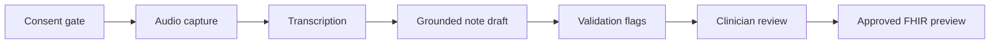

# Clinote — AI Clinical Scribe

Clinote is a consent-first ambient documentation prototype for clinician-reviewed consultation notes. It includes a doctor login screen, 15 fictional patient records, mobile-ready recording and audio upload, speaker-separated transcription, structured SOAP-style drafts, uncertainty review, clinician approval, PDF download and FHIR preview export.

> This project contains fictional demonstration data. It is not certified for clinical use and must not be used with real patient information without organisational privacy, security, clinical-safety and regulatory approval.

## Working workflow

1. Sign in, create a browser-local demo account, or continue as the demo doctor.
2. Select one of 15 fictional patients.
3. Record informed consent.
4. Capture audio with the browser microphone, upload an existing audio conversation, or use the guided dummy consultation.
5. Replay captured audio, then process the consultation through the live browser transcript, optional Groq models or clearly labelled fictional fallback.
6. Review the transcript and low-confidence wording.
7. Edit the generated Subjective, Objective, Assessment and Plan sections.
8. Resolve uncertainty items and complete clinician sign-off.
9. Download an approved PDF or export a demonstration FHIR R4 document bundle.

The microphone is blocked until consent is confirmed. Generated content remains clearly marked as a draft, and no note is approved automatically.

Live capture uses the browser Web Speech API when available. The clinician can switch the active speaker label in real time, pause or resume capture, replay the recording, search the resulting transcript, edit the note, inspect the working version, include or exclude the patient handout and record consent withdrawal. The guided demo remains available so the entire workflow can be evaluated without a microphone or external model credentials.

Mobile capture selects an audio format supported by the current browser, requests speech-optimised microphone settings, flushes recording data before pause/stop and provides permission, HTTPS and device-specific recovery messages. If direct capture is unavailable, the same screen lets the clinician record with the phone's built-in recorder and upload the file.

The included email/password account screen is for demonstration only. Its password hash and session are stored in the current browser, not in a production identity service. The saved encounter list is restored for that account on the same device; the existing hosted D1 workspace route provides server-backed records where the Sites runtime is available. For Azure production use, replace demo authentication with Microsoft Entra ID and use an approved encrypted database.

Uploaded conversations accept WEBM, WAV, MP3, M4A, MP4 and OGG files up to 24 MB. The browser validates the file, provides playback, and sends it through the same transcription, note-generation and clinician-review pipeline. Temporary audio is deleted after transcription; uploaded audio is never treated as an approved clinical record.

The capture screen also behaves as a live documentation-agent workspace: it auto-follows incoming transcript segments, shows factual coverage signals, presents the latest captured context, accepts clinician focus instructions, and timestamps markers and follow-up tasks. Focus instructions shape note organisation when an external model is configured but never authorise the system to invent clinical facts.

## Architecture



- Vinext/React interface
- Cloudflare Worker server routes
- D1 structured records and audit history
- R2 temporary audio handling
- Optional Groq transcription and note generation
- Deterministic fictional demo mode when no model credentials are configured

## Local setup

Requirements: Node.js 22.13 or newer and npm.

```bash
npm run install:ci
npm run build
npm test
```

The supported hosted development and deployment lifecycle is managed by Sites. For a local Groq-backed run, copy `.dev.vars.example` to `.dev.vars` and configure models currently available to your Groq account.

## Runtime variables

```text
GROQ_API_KEY
GROQ_CHAT_MODEL
GROQ_TRANSCRIPTION_MODEL
```

Model names are configurable and are not hard-coded. When any required value is missing, the application returns fictional sample output and labels the environment as a secure demo.

## Microsoft Azure deployment

The repository includes an Azure-ready `Dockerfile`, a Node-target Vinext build, a health endpoint at `/api/health`, and a PowerShell deployment helper for Azure Container Apps.

Requirements:

- Docker Desktop
- Azure CLI
- An Azure subscription where you have Contributor or Owner access

From PowerShell, sign in and select the correct organisational subscription:

```powershell
az login
az account list --output table
az account set --subscription "YOUR_SUBSCRIPTION_ID"
```

Deploy into the US region using the included helper:

```powershell
.\scripts\deploy-azure.ps1 -ResourceGroup "clinote-rg" -Location "eastus2" -AppName "clinote-agent"
```

For the Azure-native Phase 1 setup, connect Azure OpenAI, Azure Speech, Blob Storage, Azure SQL and Application Insights with Container App environment variables. Microsoft Entra sign-in uses these values:

```powershell
ENTRA_TENANT_ID="YOUR_TENANT_ID"
ENTRA_CLIENT_ID="YOUR_APP_REGISTRATION_CLIENT_ID"
ENTRA_CLIENT_SECRET="secretref:entra-client-secret"
ENTRA_REDIRECT_URI="https://YOUR_CONTAINER_APP_FQDN/api/auth/callback"
```

Google sign-in uses a Google Cloud OAuth web client:

```powershell
GOOGLE_CLIENT_ID="YOUR_GOOGLE_OAUTH_CLIENT_ID"
GOOGLE_CLIENT_SECRET="secretref:google-client-secret"
GOOGLE_REDIRECT_URI="https://YOUR_CONTAINER_APP_FQDN/api/auth/google/callback"
```

If a provider is not configured, its route returns a setup message instead of a 404. Emergency local access remains available from the sign-in screen for training and recovery only.

Useful management commands:

```powershell
az containerapp show --name "clinote-agent" --resource-group "clinote-rg" --query properties.configuration.ingress.fqdn --output tsv
az containerapp logs show --name "clinote-agent" --resource-group "clinote-rg" --follow
az containerapp revision list --name "clinote-agent" --resource-group "clinote-rg" --output table
```

To publish a later code update, run the same deployment helper again from the updated project directory.

The Azure container supports the complete audio-upload, Azure Speech transcription, Azure OpenAI note-review workflow and Microsoft/Google redirect/callback routes. The existing D1/R2 audit persistence is specific to the current Sites deployment; for production patient data on Azure, complete Azure SQL schema migration, private networking, managed identities, retention policies and organisational clinical-security review.

## Safety boundaries

- Documentation support only
- No autonomous diagnosis, prescriptions, orders or treatment selection
- Transcript-grounded generation prompt
- Structured output validation
- Human review and sign-off
- Immediate temporary-audio deletion in the current prototype
- Immutable audit-event model
- No clinical information in application logs or errors

Before real deployment, complete a privacy impact assessment, clinical-safety review, data-residency approval, vendor processing agreement, records-retention schedule and applicable medical-software classification review.
